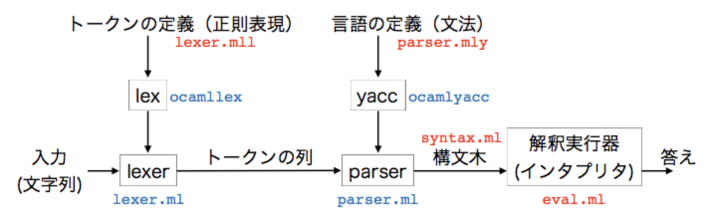

# 授業めも
## リンク
[計算モデル論教科書](http://pllab.is.ocha.ac.jp/~asai/class/model20/book.pdf)
[最低限のlex/yacc](http://pllab.is.ocha.ac.jp/~asai/class/automaton20/lex-yacc.html)

# 計算モデル論
BNF ... Backus-Naur Form

# 最低限のlex/ycc
## 字句解析と構文解析
入力文字列の解析 
- 字句解析
  - 入力の文字列を意味のある塊ごとに分解する
  - 「北に行く」を「北」「に」「行く」に分ける
- 構文解析
  - 得られた単語の列が指定された文法に従っているかをチェックする
  - ○「北に行く」×「行くに北」
  - 文法に従っていた時には**構文木**を返す
    - 構文木 ... 文法構造を木で示したもの

## lexとyacc
- lex
  - 字句解析を行うツール
  - lexical analysis
  - 字句の定義を受け取ったら字句解析を行うプログラムを返す
- yacc
  - 構文解析を行うツール
  - yet another compiler compiler
  - 文法規則を受け取ったら構文解析を行うプログラムを返す

## インタープリターの全体像
- lexer.mll 字句の定義
- parser.mly 文法の定義
- syntax.ml （抽象）構文木の定義
- eval.ml 入力された式の計算
- main.ml メインファイル



### Syntax: 構文木の定義
- 糖衣構文（シンタクティックシュガー）
  - ユーザーの入力には許されているけれども、内部的には他の構文に変換されるような構文のこと
- 抽象構文木（Abstract Syntax Tree, AST）

```
(* ２項演算子の型 *)
type op_t = Minus | Times

(* Syntax.t: parser が出力する抽象構文木の型 *)
type t  = Num of int            (* 整数 *)
        | Op of t * op_t * t    (* ２項演算 *)
```

- 具象構文木
  - 入力文字列を構文解析するときに使う構文木

### Parser: 構文解析ファイル
大きく分けて三つの役割がある
- 補助的な変数や関数、型の定義
- 各種の定義と宣言
- 構文解析の規則（文法）